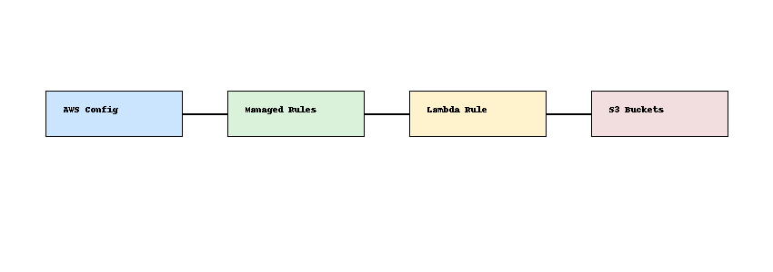

# Cloud Security Governance Checks 🔐📋

This project defines governance checks using AWS Config and a custom AWS Lambda rule to detect publicly accessible S3 buckets.

## 🧰 Stack

- AWS CDK (TypeScript)
- AWS Config Managed + Custom Rules
- Lambda Function for custom detection logic

## 📊 Architecture



## 📁 Structure

- `lib/` – CDK stack
- `lambda/` – Lambda function for custom rule
- `README.md` – Instructions and architecture

## 🚀 Deploy

```bash
npm install
cdk bootstrap
cdk deploy
```

## ✅ Governance Logic

- Enables AWS Config recorder
- Adds managed rules:
  - `s3-bucket-public-read-prohibited`
  - `s3-bucket-public-write-prohibited`
- Adds a custom Lambda rule to flag buckets based on custom tags

