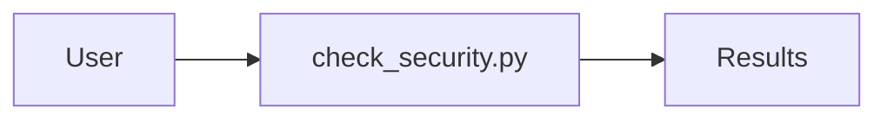

# Cloud Security Governance Checks

A minimal stub that simulates running governance checks (e.g., flagging public S3 buckets). It runs a Python script.


```mermaid
flowchart LR
    User --> Script[check_security.py]
    Script --> Output[Results]
```

## 📂 Structure

```
cloud-security-governance-checks/
├── README.md
├── requirements.txt
└── check_security.py
```

## 🚀 Usage

```bash
python check_security.py
```

## 📜 License

MIT License
