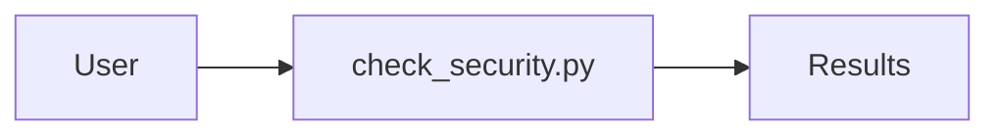

# Cloud Security Governance Checks

A lightweight script that loads a JSON list of cloud resources (see `resources.json`) and applies simplified governance rules:
- flagging S3 buckets marked `public`
- warning if an EC2 instance has `security_group_open` set to true

This mirrors how basic IaC scanners generate findings.


```mermaid
flowchart LR
    User --> Script[check_security.py]
    Script --> Output[Results]
```

## 📂 Structure

```
cloud-security-governance-checks/
├── README.md
├── requirements.txt
├── check_security.py
└── resources.json   # sample data file used by the script
```

## 🚀 Usage

```bash
python check_security.py
```

## 📜 License

MIT License
